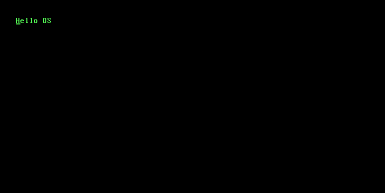

### Hello OS

A simple operating system writen in Rust.

#### Goal

The main project goal is to have a shell-like program that runs other programs inside the operating system.

- [x] Run OS inside a virtual machine
- [x] Build a general utility to display text on screen
- [ ] Accept and handle input from keyboard
- [ ] Build a kernel memory management solution
- [ ] Start developing a shell

> [!NOTE]
> This is just a personal project to start learning kernel development & explore kernel-level stuff.

###### Resources

- https://darkcoding.net/software/a-very-small-rust-binary-indeed/
- https://doc.rust-lang.org/nightly/rustc/platform-support/arm-none-eabi.html
- https://os.phil-opp.com/freestanding-rust-binary/#summary
- https://os.phil-opp.com/minimal-rust-kernel/
- https://whitefiles.org/dta/pgs/c03b.htm
